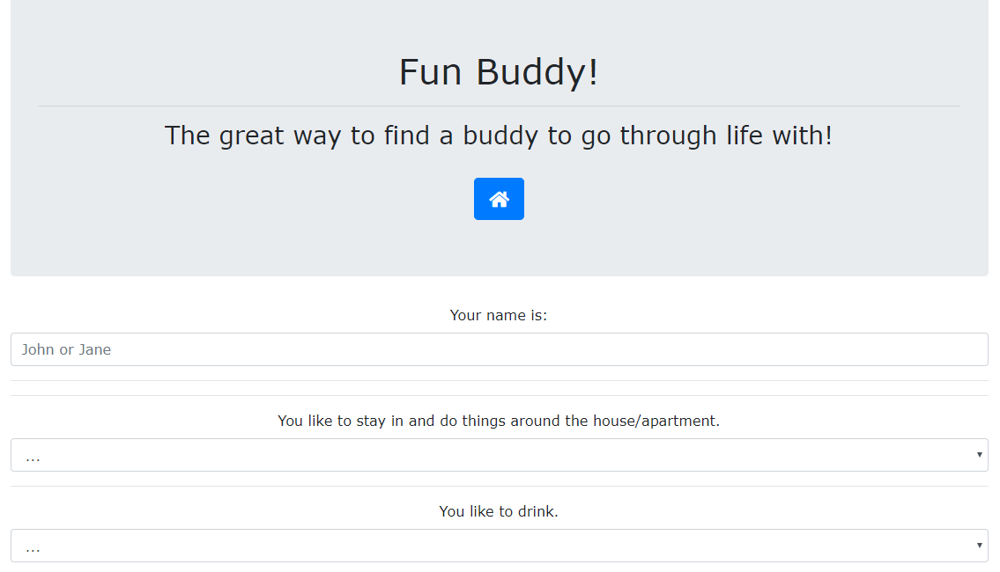
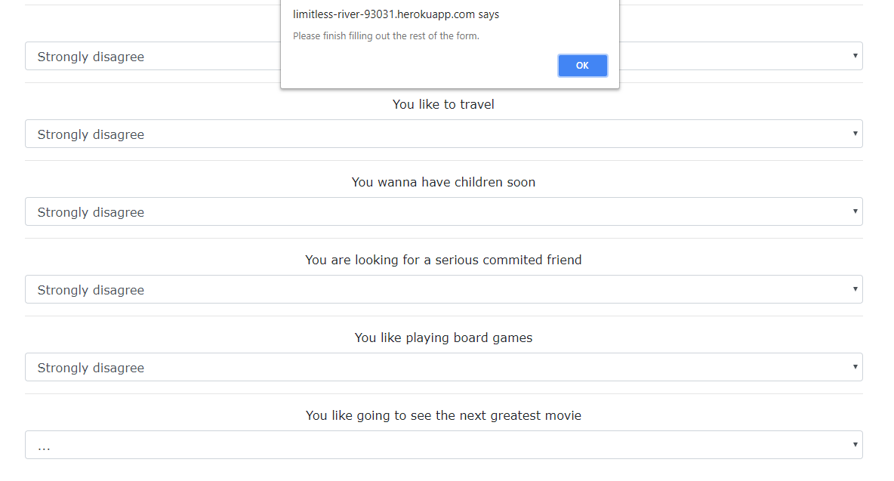

# FriendFinder-app

The Friend Finder app (AKA Fun Buddy) is a way to showcase the use of both form validation and input and receiving the appropriate match to your answers. To view the deployed version that is on Heroku please go to: https://limitless-river-93031.herokuapp.com/

Below are some basic instructions on how the app runs.

1. upon opening you will be greated by the home page and there will be a button available to push to take you to the survey.

2. upon the survey page open please fill out your name and each drop down on the page until you reach the botton to click on the submit button.

Note! If you do not fill out all of the fields you will receive an error message telling you to make sure you fill out all of the fields.

3. after all of the fields have been filled out and you click the submit button you will receive the name of your best match at the bottom of the page.

